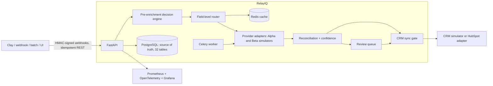

# RelayIQ — Enrichment Control Plane

RelayIQ is middleware that sits **between** your GTM stack (Clay-style workflows, webhooks,
CSV batches) and your CRM (HubSpot-style), and decides — per record, per field — whether to
spend enrichment credits at all, which provider should answer each field, whether the
answers can be trusted, and whether they're good enough to write into the CRM.

It does **not** replace Clay, HubSpot, Salesforce, or data providers. It is:

1. a **pre-enrichment decision endpoint** (reject/skip/cache/enrich before any credit is spent),
2. a **field-level enrichment router** (company domain from the cheap firmographics provider,
   job title from the fresh-people provider),
3. a **post-enrichment quality layer** (normalization, conflict reconciliation, confidence),
4. a **human-review workflow** (audited, reversible),
5. a **CRM synchronization gate** (low-confidence data never silently overwrites your CRM),
6. a **cost, decision, and lineage ledger** (every credit and every decision is queryable).

## Who it's for and why it exists

RevOps teams, growth agencies, and GTM engineers running Clay + HubSpot/Salesforce + multiple
data providers routinely pay for: duplicate enrichment (replayed webhooks, re-run tables),
enrichment of records that campaign filters would have rejected anyway, re-buying data they
already own, and conflicting provider answers that quietly overwrite good CRM data. RelayIQ
makes each of those a **measured, controlled decision** instead of an accident.

### Measured impact (seeded synthetic benchmark — see honesty notes below)

Same 495 submissions (431 unique contacts + 15% duplicate deliveries), same simulated
providers, same ground truth:

| Strategy | Cost (credits) | Field precision | True usable leads | Cost / usable lead |
|---|---|---|---|---|
| Naive (all providers, every record) | 2,886.8 | 0.682 | 218 | **13.24** |
| + cache/idempotency | 2,514.6 | 0.682 | 218 | 11.54 |
| + pre-filters | 1,318.6 | 0.682 | 218 | 6.05 |
| + static field-level routing | 987.8 | 0.773 | 243 | **4.07** |
| Full RelayIQ (+ staleness cross-check + confidence gating) | 1,097.8 | **0.784** | 236 | 4.65 |
| Dynamic routing (learned) | 1,329.8 | 0.728 | 224 | 5.94 |

Reproduce with `make benchmark` (`docs/benchmarks/results.md` is regenerated from your run).
Notable honest findings: field-level routing improved **both** cost and quality (the fresh-titles
provider wins people fields; the cheap firmographics provider wins company fields); dynamic
routing **lost** to a well-tuned static policy at 2-provider scale because its warmup spend
wasn't recouped; the full pipeline costs slightly more than static routing because it buys
second opinions on stale answers and routes ~5% of records to human review (conservatively
excluded from its usable-lead count).

**What "measured" means here:** provider costs, latencies, and error behavior are **simulated**
(two deterministic provider personalities reading a synthetic world with known ground truth).
The control plane being measured — caching, filtering, routing, reconciliation, confidence,
idempotency — is the real production code. No live Clay, HubSpot, or commercial-provider calls
were made in this build. See `docs/architecture/provider-sdk.md` (ADR-009).

## Architecture



The full workflow per request: authenticate → validate → resolve tenant/campaign → **idempotency
claim** → match/create canonical entity → **pre-enrichment checks** (identifiers, domain/email
validity, suppression, duplicates, existing fresh fields, campaign filters, budget, provider
availability, permitted-use policy) → **field-level routing** → Redis cache check → **budget
reservation** (single guarded UPDATE — concurrency-safe) → provider calls with bounded retries,
circuit breakers, and per-field fallback → normalize → **persist every observation** (never
overwrite) → **reconcile conflicts** (grouped by value-equivalence, weighted by provider
reliability × freshness × format validity, human-readable reasoning) → **confidence scoring**
(documented rules-v1 formula) → auto-accept or review → **CRM gate** per field → sync → ledger,
lineage, audit, metrics.

## How the key mechanisms work

- **Field-level routing** (`relayiq/engines/routing.py`): a YAML/JSON policy maps
  `entity.field` → candidate providers + strategy (`cheapest_capable`, `quality_first`,
  `balanced`, `dynamic`). Every decision stores candidates, scores, rejections, and factors.
- **Confidence** (`relayiq/engines/confidence.py`): weighted mean of provider prior,
  freshness decay, cross-provider agreement, format validity, consistency, provider-native
  confidence, and review history, minus a conflict penalty. It is a **heuristic score, not a
  calibrated probability**: measured Brier 0.164, ECE 0.091 on synthetic truth — overconfident
  in the 0.8+ buckets. Full reliability table: `docs/benchmarks/calibration.md` (`make calibration`).
- **Reconciliation** (`relayiq/engines/reconciliation.py`): all observations are preserved;
  values are grouped by normalized equivalence ("Acme Inc." agrees with "Acme Corporation";
  `acme.com` conflicts with `getacme.com` at severity 0.9), groups are weighted, and the outcome
  (auto-accept / accept-with-warning / require-review / reject-all / retain-CRM) ships with
  prose reasoning you can read in the UI.
- **Idempotency** (`relayiq/services/idempotency.py`, ADR-007): a DB unique constraint on
  (tenant, scope, key) makes claims atomic; completed requests replay their stored response.
  A replayed webhook delivery (`X-Delivery-Id` dedup + HMAC) returns `duplicate: true` and
  spends **zero** credits — this is covered by tests.
- **Webhook security** (`relayiq/services/webhook_security.py`): Stripe-style
  `t=<ts>,v1=<hex>` HMAC-SHA256 over the raw body, `hmac.compare_digest` everywhere,
  ±replay window enforcement, secret rotation (multiple secrets tried), delivery-ID dedup.
- **CRM gate** (`relayiq/services/crm_gate.py`, ADR-008): per-field decisions —
  write / no-write / secondary property / require approval / preserve CRM / mark refresh —
  with stored reasons. A fresh CRM value is never overwritten by lower-confidence enrichment.
- **Cost ledger** (`relayiq/services/ledger.py`): one row per attempted cost-bearing
  operation, including cache hits with the avoided cost, later-acceptance flags, and
  stale-spend flags. Cost-per-usable-lead uses the configurable usable-lead definition
  (`relayiq/config.py`, `docs/benchmarks/metric-definitions.md`).

## Run it locally

```bash
git clone <repo> && cd RelayIQ
cp .env.example .env          # dev defaults work out of the box
docker compose up --build     # API :8000, dashboard :5173, Grafana :3000, Prometheus :9090
```

The API container applies migrations and seeds a demo tenant (127 synthetic accounts,
236 contacts, all data 100% synthetic — `.test` domains, invented names). Log into the
dashboard at http://localhost:5173 with `operator@demo.relayiq.test` /
`relayiq-demo-password` (dev-only seed users; roles: admin, operator, reviewer, analyst).
API docs: http://localhost:8000/docs. A Bruno collection lives in `docs/api/bruno/`.

Host-based development (Postgres on :5433 + Redis via `make dev-deps`):

```bash
make setup && make dev-deps && make migrate && make seed
make api          # uvicorn on :8000
make dashboard    # vite dev server on :5173
make worker       # celery worker
```

## Tests, benchmarks, load

**302 backend tests pass** (259 unit; integration incl. role-matrix, cross-tenant isolation,
and concurrency races; all 12 required e2e scenarios), plus 6 Playwright UI flows.
Measured load (dev laptop, `docs/benchmarks/load-test-results.md`): 2,061 requests,
**0 failures**, 35 req/s sustained, p50 32 ms / p95 580 ms; idempotent replays p50 12 ms.

```bash
make test              # unit tests
make test-integration  # against real Postgres + Redis (make dev-deps first)
make test-e2e          # the 12 end-to-end scenarios (duplicate webhooks, budget blocks, reversals…)
cd apps/dashboard && npm run e2e   # Playwright UI flows (stack must be running)
make benchmark         # regenerates docs/benchmarks/results.{json,md}
make calibration       # regenerates docs/benchmarks/calibration.{json,md}
make load-test         # locust, 25 users / 60s — local-machine numbers only
```

## Integration status (no fake claims)

| Integration | Status |
|---|---|
| Provider Alpha / Beta | **Simulated** — deterministic personalities behind the real adapter SDK |
| Clay | **Contract implemented, not live-tested** — sidecar HTTP contract matches Clay's generic HTTP-API column; see `docs/architecture/clay-integration.md` for unverified assumptions |
| HubSpot | **Adapter implemented + fixture-tested** (v3 objects API, rate-limit/retry handling, dry-run); **live sync not verified** — set `HUBSPOT_ACCESS_TOKEN` and a `hubspot` CRM connection to try it |
| CRM simulator | **Fully working** — inspectable via API/UI, used by the e2e suite |
| Salesforce | **Designed only** — interface parallel to HubSpot, see roadmap |

## Security

Threat model: `docs/security/threat-model.md`. Highlights: HMAC verification before any
webhook processing (constant-time, replay-windowed, rotation-aware), SSRF-guarded callback
URLs (private-network + metadata-endpoint blocking, DNS-rebinding conservative, re-validated
at send time), JWT auth with roles re-checked against the DB (never from request headers),
tenant scoping on every query, concurrency-safe budgets via guarded UPDATEs, bounded retries +
circuit breakers, structured logs with secret/PII redaction, dependency + secret + container
scanning in CI. Known gaps are listed in `SECURITY.md` — the dev JWT login is a documented
OAuth substitute and this build has **not** had an external security review.

## Limitations (read before citing this project)

- All provider economics are simulated; benchmark ratios depend on the synthetic world's
  conflict/staleness rates (configurable — rerun with your own assumptions).
- Confidence is measurably miscalibrated (ECE 0.091) — it ranks well but is not a probability;
  the learned-model path is designed, not built.
- Live Clay/HubSpot verification, Salesforce, and multi-region are not implemented.
- Load-test numbers in `docs/benchmarks/` are from a development laptop.
- Auth is JWT + seeded users (a documented OAuth substitute) — wire your IdP before exposing
  this to an organization; no external security audit has been performed.

## Production hardening

With `RELAYIQ_ENV=production` the app **refuses to boot** on dev-default/weak secrets,
localhost/wildcard CORS, or an unprotected `/metrics`. Redis-backed rate limiting (login,
webhooks, API), shared circuit breakers, security headers + CSP, request-body caps,
per-tenant webhook secrets, and a production seed guard are built in — work through
[docs/production-checklist.md](docs/production-checklist.md) before deploying.

## Why this matters to a RevOps buyer

You can't manage what you can't see: RelayIQ turns enrichment from an invoice into a ledger.
Every credit maps to a field, a provider, a decision, and an outcome — so "cost per usable
lead" is a queryable number, not a quarterly guess. The benchmark shows the shape of the win:
filters stop paying for leads you'd throw away, caching stops paying twice for webhooks and
re-runs, field-level routing buys each answer from whoever is actually good at it, and the
CRM gate keeps bad data from becoming permanent. On the synthetic workload that's a 3.3×
improvement in cost per usable lead with **higher** field accuracy — your ratio will differ,
which is exactly why the ledger exists.

## More documentation

- `docs/architecture/` — overview + sequence diagrams, canonical schema, provider SDK,
  routing policies, Clay contract, tenancy
- `docs/adr/` — 13 architecture decision records
- `docs/benchmarks/` — metric definitions (with formulas), benchmark + calibration reports
- `docs/pilot/` — pilot recruitment kit (no pilots conducted yet — templates only)
- `docs/interview-guide.md` — implementation-grounded Q&A
- `docs/deployment.md`, `infrastructure/terraform/` — deployment paths (~$0–25/mo targets)
- `docs/roadmap.md`, `CONTRIBUTING.md`, `SECURITY.md`
