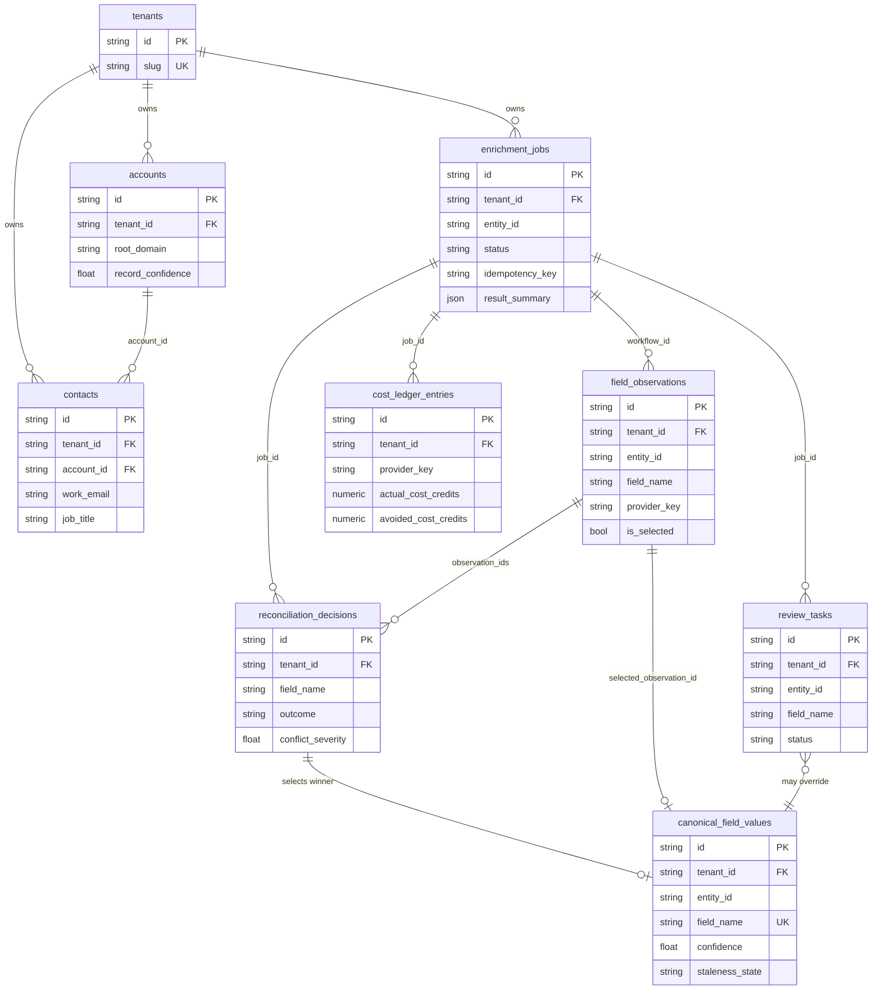

# Canonical schema — the 32 tables

PostgreSQL is the source of truth (ADR-002). All models live in
`apps/api/relayiq/models/`; every tenant-owned table carries an indexed
`tenant_id` FK (`models/base.py::TenantMixin`, ADR-010), UUID string PKs
(`PKMixin`), and `created_at`/`updated_at` timestamps (`TimestampMixin`). JSON
columns are JSONB on Postgres (`JSONVariant`). Enum-like columns store plain
VARCHAR values from `relayiq/enums.py` (stable API contract, portable to SQLite for
unit tests).

## Tables by domain

### Tenancy & governance — 5 tables (`models/tenancy.py`)

| Table | Purpose | Notable constraints |
|---|---|---|
| `tenants` | Tenant registry | unique `slug` |
| `users` | Auth principals; role + active flag re-checked per request (`api/deps.py`) | unique `(tenant_id, email)` |
| `audit_events` | Append-only audit trail (actor, action, before/after, trace_id) | indexed by tenant+object, tenant+created |
| `policy_decisions` | Allow/deny decisions from the policy service, with reasons | — |
| `suppressions` | Do-not-enrich lists (domain/email/company_name, optional expiry) | unique `(tenant_id, kind, value)` |

### Canonical entities — 4 tables (`models/entities.py`)

| Table | Purpose | Notable constraints |
|---|---|---|
| `accounts` | Canonical companies (firmographics, `record_confidence`) | indexed tenant+root_domain, tenant+normalized_name |
| `contacts` | Canonical people (title/seniority/dept, `account_id` FK) | indexed tenant+work_email, tenant+account |
| `external_identifiers` | Cross-system ID map (hubspot/salesforce/clay/simulator) | unique `(tenant_id, system, external_id)` |
| `canonical_field_values` | The *selected* value per (entity, field): confidence, staleness state, source kind, manual `locked` flag, links to the winning observation + reconciliation decision (ADR-006) | unique `(tenant_id, entity_type, entity_id, field_name)` |

### Evidence — 1 table (`models/observations.py`)

| Table | Purpose | Notable constraints |
|---|---|---|
| `field_observations` | One row per provider-returned field value — raw + normalized value, provenance (provider, request, timestamps), cost, provider/internal confidence, validation results, selection/rejection flags. **Never overwritten** (ADR-006) | indexed by entity+field, provider+field, request |

### Providers — 5 tables (`models/providers.py`)

| Table | Purpose | Notable constraints |
|---|---|---|
| `provider_configs` | Global provider registry (adapter key, timeouts, retries, reliability prior, simulator knobs). `tenant_id NULL` = all tenants (ADR-010) | unique `key` |
| `provider_capabilities` | Per provider × entity_type × field: cost (credits) and quality prior | unique `(provider_id, entity_type, field_name)` |
| `provider_requests` | One row per logical provider call: outcome, latency, cost, retry count, trace | indexed by entity, provider+created |
| `provider_responses` | Raw + normalized payloads per request — simulator payloads today; retention rules for real vendors in ADR-012 | FK → provider_requests |
| `provider_health_windows` | 5-minute rolling aggregates per provider (counts by outcome, p50/p95/p99 from a bounded latency reservoir, cost) — feeds routing health penalties | unique `(provider_key, window_start)` |

### Campaigns, jobs & decisions — 11 tables (`models/enrichment.py`)

| Table | Purpose | Notable constraints |
|---|---|---|
| `campaigns` | Campaign config: filters, required fields, `min_confidence`, routing policy ref, `crm_write_enabled` | — |
| `budgets` | Hard/soft budgets with `spent`/`reserved` credits (guarded-UPDATE reservation, `services/budget.py`), warning threshold, degradation mode, per-record/field caps | indexed tenant+campaign |
| `enrichment_jobs` | The unit of work: requested fields, status, pre-decision + reasons, costs, `result_summary`, idempotency key, callback URL, batch id, trace id | indexed tenant+status/entity/created |
| `workflow_steps` | Persisted pipeline steps per job (the 9 step names in `engines/orchestrator.py`) with status, timing, detail JSON | indexed `(job_id, sequence)` |
| `routing_decisions` | Per job × field: scored candidates, selected/rejected providers, strategy, expected vs actual cost, fallback detail | indexed `(job_id, field_name)` |
| `reconciliation_decisions` | Per field: observation set, outcome, chosen value, prose reasoning, conflict severity | indexed by entity+field |
| `confidence_evaluations` | Field/entity/sync-level scores with full component breakdown, `formula_version` (rules-v1) | indexed by entity+level |
| `idempotency_records` | Durable idempotency claims (ADR-007): status, request hash, response snapshot, expiry | unique `(tenant_id, scope, key)` |
| `cost_ledger_entries` | One row per attempted cost-bearing operation: estimated/actual cost, outcome, cache status, redundancy + avoided cost, acceptance flags, stale-spend flag | indexed tenant+created/campaign/provider, job |
| `staleness_policies` | fresh/aging/stale day thresholds per entity×field; `tenant_id NULL` = global default | unique `(tenant_id, entity_type, field_name)` |
| `routing_policies` | Versioned routing policy documents (JSON in DB, YAML at the API edge) | unique `(tenant_id, name)` |

### Review — 2 tables (`models/review.py`)

| Table | Purpose | Notable constraints |
|---|---|---|
| `review_tasks` | Human review queue: reason, priority, suggested value/observation, status lifecycle | one *open* task per (entity, field) enforced by `services/review.py::create_task` upsert |
| `review_decisions` | Append-only reviewer actions; `previous_state` snapshot makes reversals lossless; optional idempotency key | indexed by task |

### CRM — 3 tables (`models/crm.py`)

| Table | Purpose | Notable constraints |
|---|---|---|
| `crm_connections` | Configured CRM per tenant (simulator/live/dry_run); credentials **not** stored here | — |
| `crm_sync_attempts` | Per sync: per-field gate decisions + reasons, dry-run flag, status, external id | unique `(tenant_id, idempotency_key)` |
| `crm_sim_records` | The built-in CRM simulator's store (per-property values + freshness) so "the CRM" is inspectable in tests/UI | unique `(tenant_id, object_type, external_id)` |

### Webhooks — 1 table (`models/webhooks.py`)

| Table | Purpose | Notable constraints |
|---|---|---|
| `webhook_deliveries` | Delivery dedup + audit: signature/timestamp validity, sha256 `payload_hash` (full payloads NOT retained — ADR-012), event meta, linked job | unique `(tenant_id, source, delivery_id)` |

**Total: 5 + 4 + 1 + 5 + 11 + 2 + 3 + 1 = 32 tables.**

## Core entity relationships (9 central tables)

(Arrows follow logical references; most cross-references are plain indexed string
columns rather than enforced FKs — deliberate, so decision/audit rows survive entity
lifecycle operations. Enforced FKs exist where cascade semantics matter: tenants,
accounts→contacts, provider config/capability, workflow steps, review decisions,
provider responses.)

## Reading paths worth knowing

- **"Why does this contact have this title?"** — `canonical_field_values` →
  `selected_observation_id` → `field_observations` (provider, timestamps, request) →
  `reconciliation_decisions.reasoning` → `confidence_evaluations.components`.
- **"Where did the money go?"** — `cost_ledger_entries` by job/campaign/provider;
  `result_accepted` and `avoided_cost_credits` separate waste from value
  (`services/ledger.py::cost_summary`, `cost_per`).
- **"What did the pipeline do?"** — `workflow_steps` for the job, in `sequence`
  order; each step's `detail` JSON holds routes, hits, outcomes.
