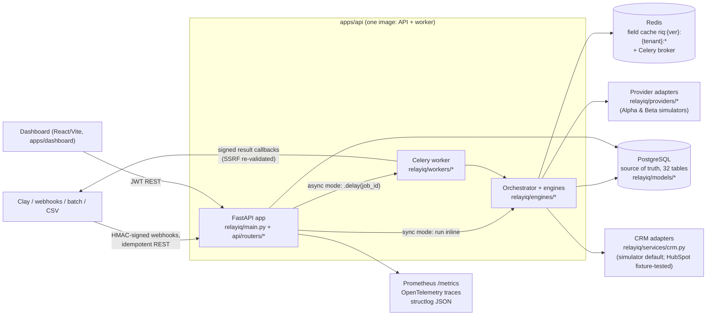
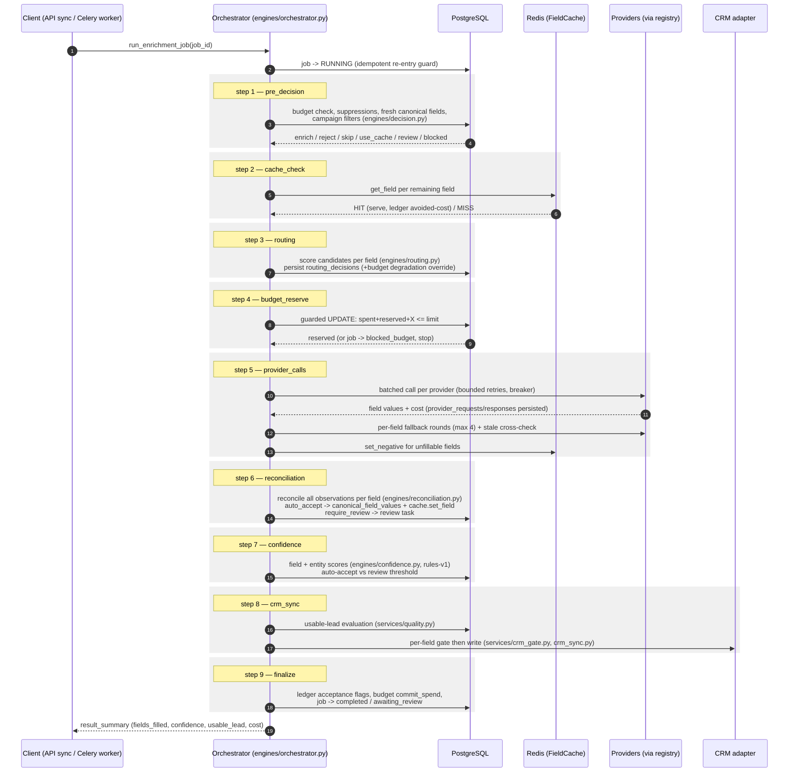

# RelayIQ architecture overview

RelayIQ is an **enrichment control plane**: middleware between GTM tooling
(Clay-style workflows, webhooks, batches) and the CRM that decides — per record, per
field — whether to spend enrichment credits, which provider answers each field,
whether the answers can be trusted, and whether they may be written to the CRM.
Providers in this build are **simulated** (ADR-009); the control plane around them is
the real production code.

## System components

- **API** (`relayiq/main.py`, `relayiq/api/routers/*`) — FastAPI app with an
  observability middleware (correlation IDs, `relayiq_http_*` metrics), JWT auth
  re-verified against the DB per request (`api/deps.py`), and routers for
  enrichment, entities, review, CRM, admin, metrics, auth, and webhooks.
- **Worker** (`relayiq/workers/`) — Celery tasks running the *same* orchestrator code
  as the sync API path; also delivers HMAC-signed result callbacks with SSRF
  re-validation at send time.
- **Orchestrator + engines** (`relayiq/engines/`) — the pipeline below; each step is
  persisted as a `workflow_steps` row and committed at step boundaries so partial
  failures leave an inspectable trail.
- **PostgreSQL** — source of truth (ADR-002): 32 tables covering canonical entities,
  observations, decisions, ledger, review, CRM sync, webhooks
  (see `docs/architecture/canonical-schema.md`).
- **Redis** — tenant- and schema-version-scoped field cache with negative entries and
  stale-while-revalidate TTLs (ADR-003), plus the Celery broker/result backend.
- **Providers** — adapter SDK (`providers/base.py`) with two deterministic simulator
  personalities (`providers/simulators.py`); registry + circuit breakers in
  `providers/registry.py` (see `docs/architecture/provider-sdk.md`).
- **CRM** — adapter interface with a fully working simulator and a fixture-tested
  (not live-verified) HubSpot adapter; all writes pass the per-field sync gate
  (`services/crm_gate.py`, ADR-008).
- **Dashboard** (`apps/dashboard`) — React UI over the REST API (review queue, cost
  ledger, job/lineage inspection).

## The enrichment pipeline

One `EnrichmentJob` flows through nine persisted steps. The step names below are
exactly the `step_name` values written by `relayiq/engines/orchestrator.py`
(`run_enrichment_job`) into `workflow_steps`:

Terminal pre-decisions (anything but `enrich`) end the job after step 1 with
zero provider spend — cache-served fields get zero-cost ledger entries recording the
avoided cost. A failed budget reservation ends the job after step 4 as
`blocked_budget`.

## Design invariants

- **Observations are never overwritten** (ADR-006): every provider answer is a
  `field_observations` row; canonical values are *selected*, and reviewer actions are
  append-only and reversible.
- **Every cost-bearing operation gets a ledger row** (`services/ledger.py`),
  including cache hits (with measured avoided cost) — "redundant cost avoided" is
  measured, not estimated.
- **Idempotency is durable** (ADR-007): DB unique constraints, not in-memory state,
  arbitrate replays for API requests, webhook deliveries, and CRM syncs.
- **Same code sync and async**: the API's `mode: "sync"` runs the orchestrator
  inline; `mode: "async"` and webhooks run it in Celery — behavior and persisted
  trail are identical.
- **Explainability**: routing candidates/scores, reconciliation reasoning, confidence
  components, and CRM gate reasons are all persisted per decision.

## Measured behavior (for orientation, see docs/benchmarks/)

On the seeded synthetic benchmark (simulated providers, real control plane;
`docs/benchmarks/results.md`): cost per true usable lead 13.24 credits naive → 4.07
with static field routing → 4.65 for the full pipeline (which buys stale
cross-checks and routes ~5% of records to review); field precision 0.682 → 0.773 /
0.784. Dynamic routing honestly *lost* (5.94) at 2-provider scale due to warmup
cost. Load behavior on a dev laptop (`docs/benchmarks/load-test-results.md`): 2,061
requests, 0 failures, 35.4 req/s sustained, p50 32 ms / p95 580 ms, idempotent
replays p50 12 ms.
